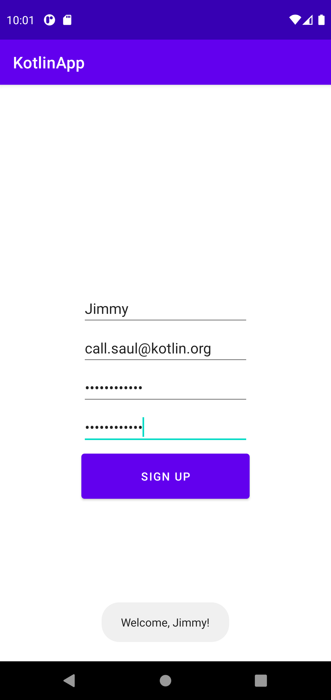

# Lab2MobileDev
Application is designed to take a name, email, password, and a password confirmation from the user. 
If the user leaves a field blank, they will receive an error instructing them to correct it (i.e. if they leave a field blank the error will appear in that field.)
Upon successfully signing the user up, they receive a toast welcoming them, as shown below\n

